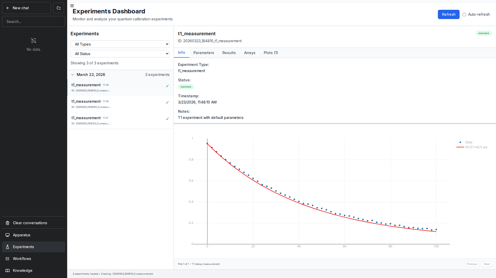
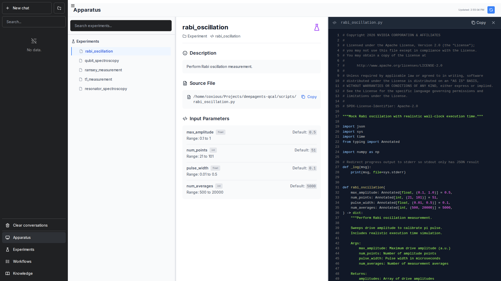

# Quantum Calibration Agent - Web UI

The web interface for [QCA](../README.md) (Quantum Calibration Agent), providing a chat-based interface for quantum calibration workflows, experiment management, and data visualization.

Built upon [chatbot-ui](https://github.com/mckaywrigley/chatbot-ui) by Mckay Wrigley and [chatbot-ollama](https://github.com/ivanfioravanti/chatbot-ollama) by Ivan Fioravanti.


## Features

- Chat interface for interacting with the quantum calibration agent
- Experiment dashboard with real-time results and plot visualization
- Workflow execution with DAG visualization and status tracking
- Apparatus browser with experiment parameter details and source code viewer
- Knowledge base with calibration documentation and guides
- Dark theme with responsive layout
- WebSocket support for real-time streaming

## Getting Started

### Prerequisites

- QCA backend running (see [Quick Start](../README.md))
- Node.js v20 or higher
- npm

### Installation

```bash
cd ui
npm ci
```

### Running

```bash
npm run dev
```

The UI will be available at `http://localhost:3000` (proxy gateway). The internal Next.js server runs on port 3099 — always access via port 3000 for proper API/WebSocket routing.

### Docker

```bash
docker build -t qca-ui .
docker run -p 3000:3000 qca-ui
```

## UI Overview

### Chat

The main chat interface connects to the QCA backend. Type questions about quantum calibration, request experiments, or ask the agent to run calibration workflows.

The agent can:
- Run calibration experiments (resonator spectroscopy, qubit spectroscopy, Rabi oscillation, Ramsey, T1)
- Analyze experiment results with VLM-powered visual inspection
- Execute multi-step calibration workflows
- Search the knowledge base for calibration documentation


### Experiments

View and monitor calibration experiments. Each experiment shows parameters, results, analysis plots, and fit data.



### Workflows

Track calibration workflow execution. The DAG view shows experiment dependencies and execution status. The status panel shows node-by-node progress and logs.


### Apparatus

Browse available calibration experiments, view their parameters, default values, and source code.



### Knowledge Base

Access calibration documentation, guides, and reference material organized by topic.


## Configuration

### Environment Variables

Create a `.env` file in the `ui/` directory:

**Backend (Required):**
- `NAT_BACKEND_URL` - QCA backend URL (e.g., `http://127.0.0.1:8000`)

**Application:**
- `NEXT_PUBLIC_NAT_WORKFLOW` - Workflow name displayed in the UI
- `NEXT_PUBLIC_NAT_GREETING_TITLE` - Custom greeting title on empty chat
- `NEXT_PUBLIC_NAT_GREETING_SUBTITLE` - Custom greeting subtitle
- `NEXT_PUBLIC_NAT_INPUT_PLACEHOLDER` - Custom chat input placeholder
- `NEXT_PUBLIC_NAT_DISCLAIMER_MESSAGE` - Disclaimer message below chat input

**Feature Toggles:**
- `NEXT_PUBLIC_NAT_WEB_SOCKET_DEFAULT_ON` - Enable WebSocket mode by default (true/false)
- `NEXT_PUBLIC_NAT_CHAT_HISTORY_DEFAULT_ON` - Enable chat history persistence (true/false)
- `NEXT_PUBLIC_NAT_ENABLE_INTERMEDIATE_STEPS` - Show agent reasoning steps (true/false)

**Proxy:**
- `PORT` - Public gateway port (default: 3000)
- `NEXT_INTERNAL_URL` - Internal Next.js URL (default: `http://localhost:3099`)

### Communication Modes

**HTTP/REST (Default)**
- Standard request-response pattern
- OpenAI Chat Completions compatible
- Supports streaming and non-streaming responses

**WebSocket (Real-time)**
- Bidirectional persistent connections
- Required for Human-in-the-Loop (HITL) workflows
- Enables server-initiated messages during long-running experiments

To enable WebSocket:
1. Open the panel on the top right of the page
2. Toggle the **WebSocket** button to ON
3. Wait for the "websocket connected" notification

## Development

### Testing

```bash
# Unit tests
npm run test:ci

# Linting
npm run lint

# Type checking
npm run typecheck
```

### Project Structure

```
ui/
  components/     # React components (Chat, Experiments, Workflows, etc.)
  pages/          # Next.js pages
  hooks/          # Custom React hooks
  utils/          # Utility functions
  types/          # TypeScript type definitions
  proxy/          # Gateway proxy server
  public/         # Static assets
  __tests__/      # Unit tests
  e2e/            # Playwright E2E tests
```

## License

See [LICENSE](LICENSE) for details.
